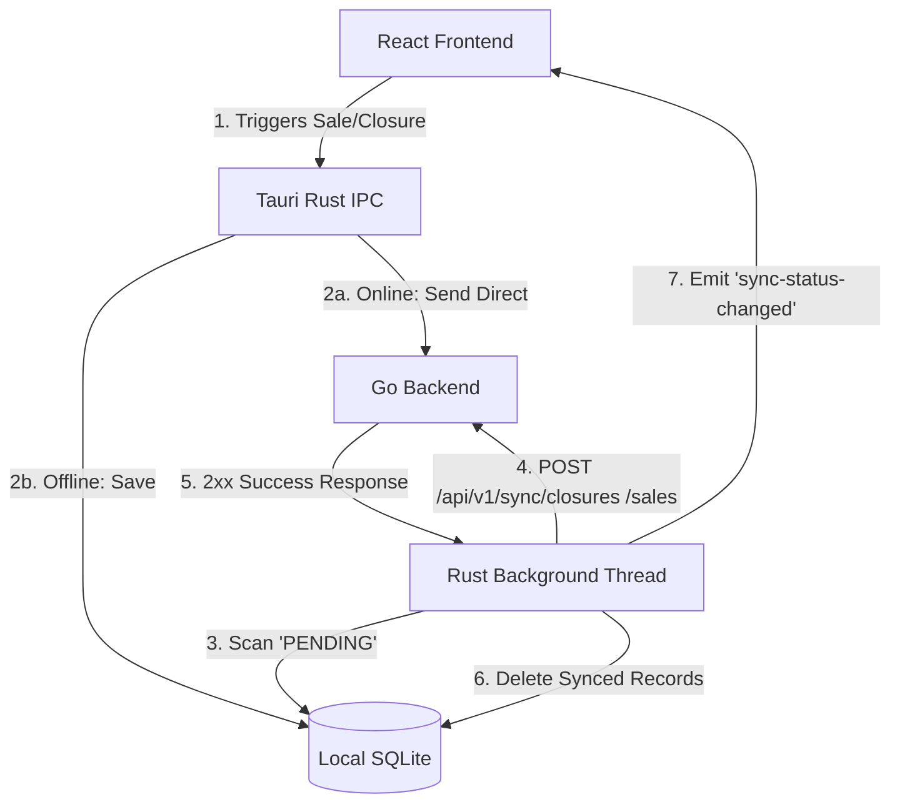

# Design: TPV Tauri Synchronization

## Technical Approach

To enable offline-first point-of-sale (TPV) operations, the Tauri desktop client will use a local SQLite database for billing and box closures when offline. A background synchronization worker in Rust will periodically scan for pending local records and sync them to the Go backend. When online, stock queries retrieve real-time data from the Go backend; when offline, they fall back to a local SQLite stock cache.

## Directory Structure

```
tpv-client/
├── package.json
├── vite.config.ts
├── src/                      # React + Vite (Frontend)
│   ├── main.tsx
│   ├── App.tsx
│   └── components/           # UI Components (e.g., SyncWarningBanner)
└── src-tauri/                # Rust Application Core
    ├── Cargo.toml
    ├── tauri.conf.json
    └── src/
        ├── main.rs           # Core Entrypoint & IPC commands setup
        ├── db.rs             # SQLite connection & queries
        └── sync.rs           # Background sync loop
```

## Local SQLite Tables Design

SQLite schema will be initialized on startup using `database/migrations/sqlite_init.sql` schema (creating `offline_sales` and `offline_sale_items`). The following new tables will be added to the SQLite schema:

```sql
CREATE TABLE IF NOT EXISTS offline_box_closures (
    id TEXT PRIMARY KEY, -- UUID stored as TEXT
    opened_at TEXT NOT NULL, -- TIMESTAMP as ISO8601 text
    closed_at TEXT NOT NULL,
    cash_reported REAL NOT NULL,
    card_reported REAL NOT NULL,
    sales_total REAL NOT NULL,
    sync_status TEXT NOT NULL DEFAULT 'PENDING',
    idempotency_key TEXT UNIQUE NOT NULL
);

CREATE TABLE IF NOT EXISTS stock_cache (
    item_id TEXT PRIMARY KEY, -- UUID stored as TEXT
    stock REAL NOT NULL,
    last_updated_at TEXT NOT NULL
);
```

## Architecture Decisions

| Option | Tradeoff | Decision |
|---|---|---|
| IPC commands vs direct sync loop | IPC requires frontend to poll or trigger; sync loop is autonomous and robust | Core background thread in Rust performs autonomous periodic sync, emitting IPC events for status updates. |
| SQLite vs local storage / IndexedDB | LocalStorage is size-limited; SQLite handles complex relational schemas and transaction safety | SQLite is utilized for offline sales, box closures, and stock caching. |

## Data Flow



## Sync Loop Architecture

A dedicated background thread spawned in Rust (`tauri::async_runtime::spawn`) runs a loop executing every 30 seconds:
1. **Network Check**: Sends a lightweight HTTP HEAD request to the backend.
2. **IPC Emission**: Emit `sync-status-changed` event (`online: boolean`, `pending_sync_count: number`).
3. **Closure Sync**: Query `offline_box_closures` for `sync_status = 'PENDING'`. Post closures to `POST /api/v1/sync/closures` with the `Idempotency-Key` header. Upon 2xx success, DELETE matching rows from SQLite.
4. **Sales Sync**: Query `offline_sales` / `offline_sale_items` for `sync_status = 'PENDING'`. Post to `POST /api/v1/sync/sales`. Upon 2xx success, DELETE matching rows from SQLite (cascade deletes items).

## File Changes

| File | Action | Description |
|------|--------|-------------|
| `tpv-client/src-tauri/src/db.rs` | Create | Handles connection to local SQLite, tables initialization, offline insertions, and status query helpers. |
| `tpv-client/src-tauri/src/sync.rs` | Create | Autonomous thread sync loop and HTTP client execution. |
| `tpv-client/src/components/SyncWarningBanner.tsx` | Create | Warning banner component displaying sync status, listening to `sync-status-changed` event. |
| `internal/sync/adapters/api_controller.go` | Modify | Implement closures sync handler `HandleSyncClosures` at `POST /api/v1/sync/closures`. |

## Interfaces / Go Backend API Contracts

### Box Closure Sync Endpoint
* **Path**: `POST /api/v1/sync/closures`
* **Headers**: `Idempotency-Key: <UUID>`
* **Request Body**:
```json
{
  "id": "550e8400-e29b-41d4-a716-446655440000",
  "opened_at": "2026-06-05T10:00:00Z",
  "closed_at": "2026-06-05T18:00:00Z",
  "cash_reported": 1500.50,
  "card_reported": 850.00,
  "sales_total": 2350.50
}
```
* **Response Body (200 OK)**:
```json
{
  "status": "success",
  "id": "550e8400-e29b-41d4-a716-446655440000"
}
```

## Testing Strategy

| Layer | What to Test | Approach |
|-------|-------------|----------|
| Unit (Rust) | SQLite schema queries & status updates | Test db operations (insert, query pending, delete) in temporary sqlite db using `cargo test`. |
| Integration (Rust) | Network drops & idempotency | Mock server endpoints in tests to simulate network drops (timeouts, 500s) and verify that SQLite is only cleaned up on 2xx responses. |
| Unit (React) | Warning banner states | Mock Tauri's `listen` event to assert warning banner visibility under `online` and `offline` event payloads. |

## Migration / Rollout

No data migration required for SQLite since clients initialize tables dynamically on installation. Feature flag `enable-tauri-sync` on Go backend controls visibility and access to sync endpoints.

## Open Questions

None.
