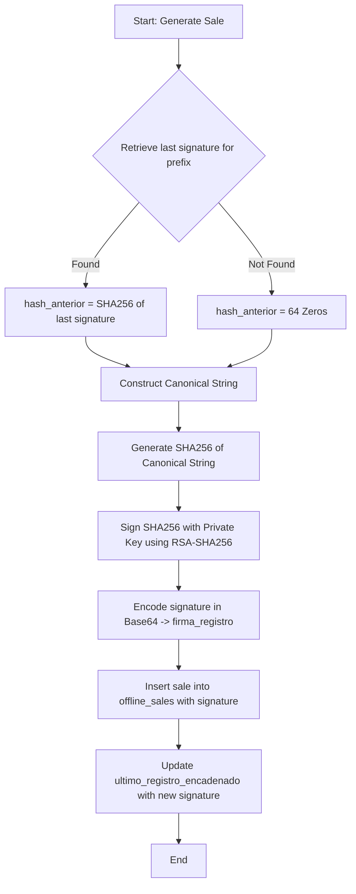

# Exploration: Veri*factu Chaining and Signatures

This document details the research, database schemas, and architectural approaches for implementing Veri*factu-compliant hash chaining and cryptographic signature generation for offline sales in the Tauri desktop client (SQLite) and Go backend.

---

## Current State

The Ferrowin POS system currently records sales offline in a local SQLite database (`tpv_offline.db`) via Rust Tauri core functions in `db.rs` and `lib.rs`.
- When a sale is saved, it is assigned a sequence number and stored in `offline_sales` with a status of `'PENDING'`.
- A background sync loop in `sync.rs` runs every 30 seconds, sending pending sales to the Go backend (`/api/v1/sync/sales`).
- Upon a successful response, `delete_synced_sale` deletes the sale and its items from the local SQLite database.
- The Go backend receives the synced sales, inserts them into the Postgres `invoice` table, and logs the corresponding stock movements in `stock_ledger_movements`.

Currently, there is no cryptographic signature, hash chaining, or trace data recorded. Synced records are completely erased from the local database, leaving no chaining metadata to support offline invoicing.

---

## Affected Areas

### 1. Database Schema
- **Local SQLite Schema (`tpv-client/src-tauri/src/db.rs` and `database/migrations/sqlite_init.sql`)**: 
  - Needs a new table `ultimo_registro_encadenado` to track the last signature per series.
  - Needs new Spanish-named columns on the `offline_sales` table.
- **Central Postgres Schema (`database/migrations/000001_init_erp_schemas.up.sql`)**: 
  - Needs new Spanish-named columns on the `invoice` table.

### 2. Tauri POS Client (Rust)
- **`tpv-client/src-tauri/src/db.rs`**:
  - Update `init_db` to include the new table.
  - Add functions to manage `ultimo_registro_encadenado`.
  - Update `OfflineSale` struct and `insert_offline_sale` to store the new Spanish metadata.
- **`tpv-client/src-tauri/src/lib.rs`**:
  - Update the `save_offline_sale` Tauri command to perform hash chaining and signature generation using the local database transaction.
- **`tpv-client/src-tauri/src/sync.rs`**:
  - Update `SyncSalePayload` to include the chaining metadata so it gets transmitted to the Go backend.

### 3. Go Backend
- **`internal/sync/adapters/api_controller.go`**:
  - Update `SyncSale` struct to receive the Spanish-named chaining fields.
  - Update `HandleSyncSales` to save this metadata into the Postgres database and execute the chain validation algorithm.

---

## Technical Specifications

### 1. Database Schema Design (Spanish Names)

As requested, all new tables and columns created for this feature are named in Spanish (Castellano).

#### SQLite Table: `ultimo_registro_encadenado`
This table maintains the reference signature of the most recent sale in each invoicing series, surviving the post-sync cleanup.
```sql
CREATE TABLE ultimo_registro_encadenado (
    prefijo_serie TEXT PRIMARY KEY,
    id_venta_local TEXT NOT NULL,
    numero_factura TEXT NOT NULL,
    firma_registro TEXT NOT NULL,
    hash_anterior TEXT NOT NULL,
    fecha_hora_firma TEXT NOT NULL
);
```

#### New Columns on `offline_sales` (SQLite) and `invoice` (Postgres)
We will add these columns to record the chain information for every individual invoice:
- `firma_registro` (TEXT / VARCHAR(512)): The Base64-encoded cryptographic signature of the invoice record.
- `hash_anterior` (TEXT / VARCHAR(64)): The hex-encoded SHA-256 hash of the previous invoice's signature.
- `fecha_hora_firma` (TEXT / TIMESTAMP WITH TIME ZONE): The exact time when the signature was generated.
- `datos_encadenamiento` (TEXT): The raw concatenated canonical data string that was hashed and signed (highly useful for verification and auditing).
- `encadenamiento_valido` (Postgres only, BOOLEAN DEFAULT FALSE): Flag indicating if the backend successfully verified the chain integrity.

---

### 2. Signing and Chaining Algorithm

Each invoice's hash and signature are linked to the previous invoice's signature in a blockchain-like sequence.



#### Algorithm Steps:
1. **Identify Series Prefix**: Extract the prefix from the invoice number (e.g. `TPV` from `TPV-0012`).
2. **Calculate Previous Hash (`hash_anterior`)**:
   - Query `ultimo_registro_encadenado` for the prefix.
   - If not found (first invoice in the series, sequence = 1):
     - `hash_anterior` = `"0000000000000000000000000000000000000000000000000000000000000000"` (64 hexadecimal zeros).
   - If found:
     - `hash_anterior` = `HexEncode(SHA256(firma_registro_anterior))`.
3. **Construct Canonical Data String (`datos_encadenamiento`)**:
   - Concatenate key-value pairs of the invoice metadata in a deterministic order. Following AEAT Veri*factu specifications, this string contains:
     - `IDEmisorFactura`: The issuer's NIF (e.g., `A12345678`).
     - `NumSerieFactura`: The invoice number (e.g., `TPV-0012`).
     - `FechaExpedicionFactura`: The issue date in `YYYY-MM-DD` format.
     - `ImporteTotal`: The total amount formatted with exactly 2 decimal places (using a dot as the decimal separator, e.g. `120.50`).
     - `HuellaAntecesora`: The calculated `hash_anterior`.
     - `FechaHoraHusoGenRegistro`: The RFC 3339 formatted generation timestamp with timezone (e.g. `2026-06-05T21:58:18+02:00`).
   - **Concatenation Pattern**:
     `IDEmisorFactura={nif}&NumSerieFactura={invoice_number}&FechaExpedicionFactura={date}&ImporteTotal={total}&HuellaAntecesora={hash_anterior}&FechaHoraHusoGenRegistro={timestamp}`
4. **Sign and Hash**:
   - Compute `SHA256(datos_encadenamiento)`.
   - Sign this hash using the private key of the client's digital certificate (RSA-SHA256).
   - Base64-encode the signature bytes -> `firma_registro`.

---

### 3. Client Cleanup Isolation

By separating the queue state (`offline_sales`) from the chaining reference state (`ultimo_registro_encadenado`), we resolve the cleanup conflict cleanly:
- When a sale syncs successfully, it is safe to execute `delete_synced_sale` (which deletes from `offline_sales`).
- The signature and metadata remain persisted in `ultimo_registro_encadenado` (one row per prefix series).
- This ensures offline chaining is fully operational even when the queue is completely empty.

---

## Approaches

We compare two approaches for where the signature and hash generation should take place:

| Component | Pros | Cons | Complexity |
|---|---|---|---|
| **Approach 1: Rust Tauri Core** (Recommended) | - **Atomic Execution**: Chaining logic and database writes happen in the same Rust transaction. If signing fails, the DB transaction rolls back, preventing a broken chain.<br>- **Key Security**: Private keys are kept in compiled Rust memory, not exposed to frontend JavaScript/V8, preventing key extraction.<br>- **Native Integration**: Easy to load certificates from OS-level certificate stores. | - Slightly more code to write in Rust using crates like `ring` or `openssl`. | Medium |
| **Approach 2: React/TS Frontend** | - Simple to write using standard JS crypto libraries (e.g. `jsrsasign` or Web Crypto API).<br>- Tauri commands remain plain data-access helpers. | - **Broken Chain Risks**: Non-atomic operations. If the app is closed after signing but before saving, the chain breaks.<br>- **Security Risk**: Private keys must be loaded in JS memory, vulnerable to XSS and memory inspections.<br>- Cannot easily access native OS certificate stores. | Low |

---

## Recommendation

We strongly recommend **Approach 1: Rust Tauri Core**.
- **Reasoning**: Cryptographic signatures for legal compliance require strict guarantees of integrity and security. Generating signatures in Rust inside a database transaction guarantees that the chain is never corrupt due to half-completed operations or frontend crashes. Additionally, storing private keys in Rust memory prevents leakage to frontend JavaScript.

---

## Risks

- **Certificate Expiry/Loss**: If the terminal certificate expires or is missing, invoice creation will fail. We must implement proper validation and a clear user warning or fallback mode (e.g. alert user to renew the certificate).
- **Concurrency on Series Sequence**: If multiple threads or UI actions try to generate invoices in the same series simultaneously, it could result in sequence gaps or duplicate previous hashes. In Tauri, wrapping invoice generation in a serialized SQLite database transaction resolves this risk.
- **Go Backend Clock Drift**: Validation compares timezone timestamps. Minor differences in clocks between the client and backend are expected, so backend validation should focus on the cryptographic signature and the hash chain sequence rather than strict millisecond clock alignment.

---

## Ready for Proposal
**Yes**. The design is clear and addresses all user requirements, database naming constraints, and offline sync behaviors. The next step is to create the formal proposal.
