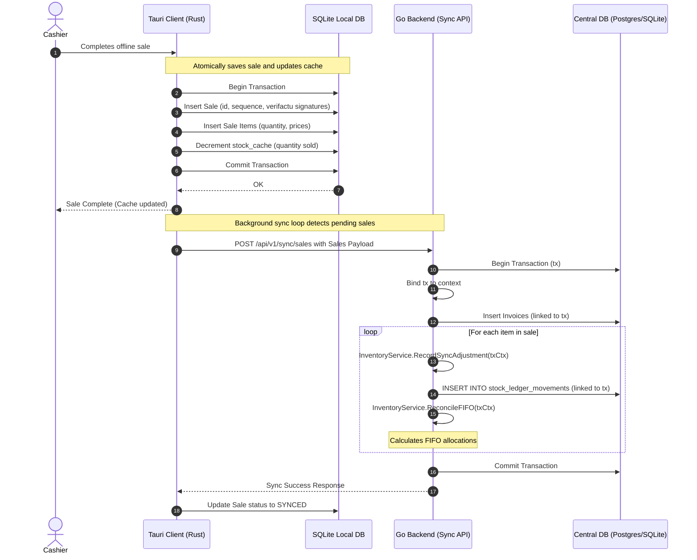

# Technical Design: Offline POS Stock Synchronization and Cache

This document outlines the technical design for introducing offline POS stock cache decrements, context-based database transaction propagation in the Go backend, and integrating the sales sync endpoint with the `InventoryService` for FIFO reconciliation.

## 1. Overview & Goals

The primary goal of this change is to maintain accurate inventory levels across both the offline client (Tauri) and the central system (Go backend).

Key objectives:
- **Tauri Client**: Decrement the local SQLite `stock_cache` table immediately when a sale is completed offline inside the same database transaction.
- **Go Backend**: Replace direct database calls in the `SalesSyncController` with calls to `InventoryService.RecordSyncAdjustment` and `InventoryService.ReconcileFIFO`.
- **Transaction Safety**: Propagate the existing database transaction started in `SalesSyncController.HandleSyncSales` into the inventory repository using context-based propagation, ensuring data consistency and atomic rollbacks.

---

## 2. Technical Approach & Architecture Decisions

### 2.1. Go Backend: Context-based Transaction Propagation

Currently, `SalesSyncController` starts a database transaction `tx, err := c.db.BeginTx(r.Context(), nil)`. However, `InventoryService` calls its repository `Save(ctx, entry)` which performs DB queries directly via `r.db` (a `*sql.DB`), causing service-triggered adjustments to run outside the transaction.

To propagate the transaction cleanly without leaking DB transaction types into the domain service layer:
1. **Context Key**: Define a package-private context key in the repository/adapter package.
2. **Context Helper**: Provide a public helper function `WithTx(ctx context.Context, tx *sql.Tx) context.Context` in the `adapters` package.
3. **Database Executor Interface**: Define an internal `dbExecutor` interface in `internal/inventory/adapters/sql_repository.go` that matches both `*sql.DB` and `*sql.Tx`.
4. **Executor Selector**: In `SQLStockLedgerRepository`, retrieve the `dbExecutor` using a helper that checks the context for an active `*sql.Tx` fallback to `r.db`.

```go
// internal/inventory/adapters/sql_repository.go

type txKey struct{}

// WithTx returns a new context containing the transaction.
func WithTx(ctx context.Context, tx *sql.Tx) context.Context {
	return context.WithValue(ctx, txKey{}, tx)
}

type dbExecutor interface {
	ExecContext(ctx context.Context, query string, args ...interface{}) (sql.Result, error)
	QueryContext(ctx context.Context, query string, args ...interface{}) (*sql.Rows, error)
	QueryRowContext(ctx context.Context, query string, args ...interface{}) *sql.Row
}

func (r *SQLStockLedgerRepository) getExecutor(ctx context.Context) dbExecutor {
	if tx, ok := ctx.Value(txKey{}).(*sql.Tx); ok {
		return tx
	}
	return r.db
}
```

This ensures the domain layer remains agnostic to database transactions, while the repository adapter transparently participates in transactions created at the controller or application level.

### 2.2. Tauri Client: Local SQLite Stock Cache updates

When an offline sale is saved via `save_offline_sale_impl` in Rust:
1. The sale details and items are written to the database inside a `rusqlite` transaction.
2. For each item in the sale, we must decrement its stock cache level in `stock_cache` within the same transaction.
3. If the item does not exist in the stock cache (i.e. it was never fetched online), we initialize it to `-quantity` so that it stays correct relative to the baseline.
4. SQLite `ON CONFLICT` is used to handle upserting:

```sql
INSERT INTO stock_cache (item_id, stock, last_updated_at)
VALUES (?1, -?2, ?3)
ON CONFLICT(item_id) DO UPDATE SET
    stock = stock - ?2,
    last_updated_at = ?3
```

---

## 3. Data Flow Diagram



---

## 4. Component & File Changes

### 4.1. `internal/inventory/adapters/sql_repository.go`
- Add `txKey` struct and `WithTx(ctx context.Context, tx *sql.Tx) context.Context` helper.
- Define `dbExecutor` interface (with `ExecContext`, `QueryContext`, `QueryRowContext`).
- Add private helper `getExecutor(ctx context.Context) dbExecutor`.
- Replace all `r.db` calls inside `Save` and `GetMovements` with calls on the returned executor from `r.getExecutor(ctx)`.

### 4.2. `internal/sync/adapters/api_controller.go`
- Import `inventoryadapters "ferrowin/internal/inventory/adapters"`.
- In `HandleSyncSales`:
  - Wrap the transaction in the context: `txCtx := inventoryadapters.WithTx(r.Context(), tx)`.
  - Replace the manual SQL stock ledger insertion loop with calls to `c.inventoryService.RecordSyncAdjustment` and `c.inventoryService.ReconcileFIFO` using `txCtx`.

### 4.3. `tpv-client/src-tauri/src/db.rs`
- Add helper function `decrement_stock_cache(conn: &Connection, item_id: &str, quantity: f64, last_updated_at: &str) -> Result<()>` which executes the `ON CONFLICT` decrement SQL statement.

### 4.4. `tpv-client/src-tauri/src/lib.rs`
- Update `save_offline_sale_impl` to loop over items, format the current ISO-8601 time, and call `db::decrement_stock_cache(&tx, &item.item_id, item.quantity, &now_iso)`.

---

## 5. API and Type Definitions

### Go Backend

```go
package adapters

import (
	"context"
	"database/sql"
)

type txKey struct{}

// WithTx embeds an active transaction in the context.
func WithTx(ctx context.Context, tx *sql.Tx) context.Context

type dbExecutor interface {
	ExecContext(ctx context.Context, query string, args ...interface{}) (sql.Result, error)
	QueryContext(ctx context.Context, query string, args ...interface{}) (*sql.Rows, error)
	QueryRowContext(ctx context.Context, query string, args ...interface{}) *sql.Row
}
```

### Tauri Client

```rust
// tpv-client/src-tauri/src/db.rs
use rusqlite::{Connection, Result};

pub fn decrement_stock_cache(
    conn: &Connection,
    item_id: &str,
    quantity: f64,
    last_updated_at: &str,
) -> Result<()> {
    conn.execute(
        "INSERT INTO stock_cache (item_id, stock, last_updated_at)
         VALUES (?1, -?2, ?3)
         ON CONFLICT(item_id) DO UPDATE SET
            stock = stock - ?2,
            last_updated_at = ?3",
        rusqlite::params![item_id, quantity, last_updated_at],
    )?;
    Ok(())
}
```

---

## 6. Testing Strategy

### 6.1. Tauri Local Stock Cache Unit Tests (`tpv-client/src-tauri/src/lib.rs`)
Implement `test_save_offline_sale_decrements_stock_cache` in Rust:
- Seed a temporary database.
- **Scenario A (Pre-cached product)**: Insert a product with stock = 10.0 into `stock_cache`. Record an offline sale for 3.0 units. Verify stock drops to 7.0 in the cache.
- **Scenario B (New product)**: Record an offline sale for 2.0 units of a product not existing in `stock_cache`. Verify stock is created and set to -2.0.

### 6.2. Go Backend Integration Tests (`internal/sync/adapters/api_controller_test.go`)
- Update `TestSalesSyncController_HandleSyncSales` to verify that when `/api/v1/sync/sales` receives items, they correctly reduce available stock in the ledger (which proves `RecordSyncAdjustment` is executed and committed).
- Verify that duplicate payloads processed under idempotency do not trigger duplicate movements, ensuring transaction integrity.
- Add a dedicated test verifying FIFO reconciliation runs during synchronization. For example:
  1. Synchronize an offline sale of 2 units of Item A (stock becomes -2.0).
  2. Register a stock receipt of 10 units.
  3. Reconcile FIFO and assert the 2 synced items are matched against the stock receipt.
