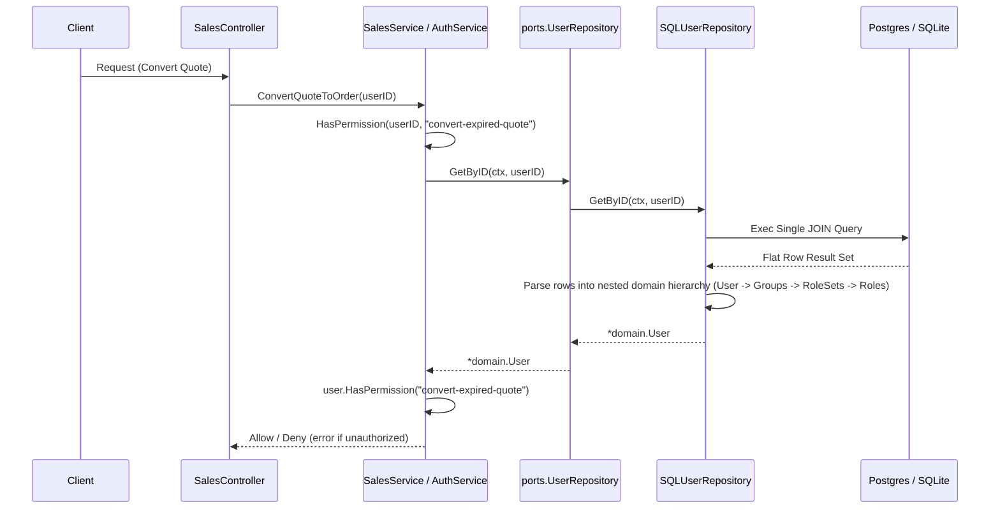

# Technical Design: User Authentication and Role-Based Access Control (RBAC)

This document describes the technical implementation design for replacing the temporary `securityStub` with a database-backed RBAC permission checking mechanism in Ferrowin.

---

## 1. Technical Approach

The security system requires permission checks on the Go backend using a role-based access control (RBAC) model. The entities involved are:
- **User**: Represents a system user. Belongs to zero or more groups.
- **Group**: Represents a security group aggregating users and mapping them to role sets.
- **RoleSet**: A collection of permissions (roles).
- **Role**: A fine-grained permission string (e.g. `convert-expired-quote`, `read-audit`).

### 1.1 Single-JOIN Hierarchy Loading
To avoid the N+1 query problem and minimize database roundtrips, we load the user's complete nested hierarchy (`User -> Groups -> RoleSets -> Roles`) in a single query when fetching by user ID or username.

```sql
SELECT 
    u.id AS user_id, 
    u.username AS user_username, 
    u.password_hash AS user_password_hash,
    g.id AS group_id, 
    g.name AS group_name,
    rs.id AS role_set_id, 
    rs.name AS role_set_name,
    r.id AS role_id, 
    r.name AS role_name
FROM users u
LEFT JOIN user_groups ug ON u.id = ug.user_id
LEFT JOIN groups g ON ug.group_id = g.id
LEFT JOIN group_role_sets grs ON g.id = grs.group_id
LEFT JOIN role_sets rs ON grs.role_set_id = rs.id
LEFT JOIN role_set_roles rsr ON rs.id = rsr.role_set_id
LEFT JOIN roles r ON rsr.role_id = r.id
WHERE u.id = $1  -- (or u.username = $1 / ? depending on driver)
```

The database rows returned will be processed in Go using temporary pointer-based structs to avoid copy-by-value synchronization issues during loop aggregations. Once built, the tree is mapped to the final value-based domain model (`domain.User`).

### 1.2 ANSI-SQL Compatibility
All queries will target standard SQL features compatible with both **PostgreSQL** and **SQLite**.
- **Upserts**: Handled using `ON CONFLICT (id) DO UPDATE SET ...` with casing adjusted dynamically or normalized (`EXCLUDED` for Postgres, `excluded` for SQLite).
- **Join Tables**: `ON CONFLICT DO NOTHING` is used to gracefully handle duplicate associations.
- **Parameters**: `isSQLite` flag determines whether `$1, $2, ...` or `?, ?, ...` placeholders are used.

### 1.3 Transaction Propagation
We propagate transaction context using Go's `context.Context` carrying a private transaction key (`txKey`). A helper `getExecutor(ctx, db)` selects the transaction if present in the context, otherwise it falls back to the database handle.

---

## 2. Architecture Decisions

- **Single Query Loading**: We chose a single JOIN query over splitting queries (loading users, then groups, then roles). Authorization checks are frequent and time-sensitive (part of the HTTP middleware/request flow). Minimizing network roundtrips keeps latency low.
- **Context-Carried Transactions**: We mirror the existing inventory adapters' transaction strategy. This keeps database access patterns consistent across all system domains and facilitates cross-domain transactions.
- **Interface Decoupling**: Repositories are defined in `internal/security/ports/` and the domain uses `UserRepositoryRequired` to break Go import cycles. This aligns with Clean/Hexagonal Architecture guidelines.

---

## 3. Data Flow Diagram



---

## 4. File Changes

### `internal/security/adapters/sql_repository.go` (New File)
This file implements:
- `SQLUserRepository` implementing `ports.UserRepository` and `domain.UserRepositoryRequired`.
- `SQLGroupRepository` implementing `ports.GroupRepository`.
- `SQLRoleSetRepository` implementing `ports.RoleSetRepository`.
- `SQLRoleRepository` implementing `ports.RoleRepository`.
- Inner struct mapping helpers (`tempGroup`, `tempRoleSet`, `tempRole`) and the multi-level hierarchy assembler.
- Context-based `getExecutor` utility.

### `main.go` (Modified)
We replace the in-memory `securityStub` with real database-backed repositories:
1. Import `securityadapters "ferrowin/internal/security/adapters"` and `securitydomain "ferrowin/internal/security/domain"`.
2. Instantiate `SQLUserRepository`:
   ```go
   secUserRepo := securityadapters.NewSQLUserRepository(db, isSQLite)
   ```
3. Instantiate the domain authorization service:
   ```go
   authService := securitydomain.NewAuthService(secUserRepo)
   ```
4. Wire `authService` to the `salesdomain.NewSalesService` injection point:
   ```go
   salesService := salesdomain.NewSalesService(salesRepo, invService, authService, billingServ)
   ```

---

## 5. API and Type Definitions

### 5.1 Repository Implementation Interfaces
From `internal/security/ports/repositories.go`:
```go
type UserRepository interface {
	GetByID(ctx context.Context, id uuid.UUID) (*domain.User, error)
	GetByUsername(ctx context.Context, username string) (*domain.User, error)
	Save(ctx context.Context, user *domain.User) error
}

type GroupRepository interface {
	GetByID(ctx context.Context, id uuid.UUID) (*domain.Group, error)
	Save(ctx context.Context, group *domain.Group) error
	AssignGroupToUser(ctx context.Context, userID uuid.UUID, groupID uuid.UUID) error
}

type RoleSetRepository interface {
	GetByID(ctx context.Context, id uuid.UUID) (*domain.RoleSet, error)
	Save(ctx context.Context, roleSet *domain.RoleSet) error
	AssignRoleSetToGroup(ctx context.Context, groupID uuid.UUID, roleSetID uuid.UUID) error
}

type RoleRepository interface {
	GetByID(ctx context.Context, id uuid.UUID) (*domain.Role, error)
	Save(ctx context.Context, role *domain.Role) error
	AssignRoleToRoleSet(ctx context.Context, roleSetID uuid.UUID, roleID uuid.UUID) error
}
```

### 5.2 Mapping Assembler Logic (in `SQLUserRepository`)
```go
type tempRole struct {
	ID   uuid.UUID
	Name string
}
type tempRoleSet struct {
	ID    uuid.UUID
	Name  string
	Roles []*tempRole
}
type tempGroup struct {
	ID       uuid.UUID
	Name     string
	RoleSets []*tempRoleSet
}
```
During row scanning, a nested map tracking structure prevents duplications of `Groups`, `RoleSets`, and `Roles`:
- `groupsMap = map[uuid.UUID]*tempGroup`
- `groupRoleSetsMap = map[uuid.UUID]map[uuid.UUID]*tempRoleSet`
- `roleSetRolesMap = map[uuid.UUID]map[uuid.UUID]map[uuid.UUID]bool`

---

## 6. Testing Strategy

### 6.1 Unit Tests (Domain Level)
We will rely on the existing tests in `internal/security/domain/auth_service_test.go`. These tests use a mock user repository to verify that standard, multi-group, and nonexistent permission checks work correctly against the RBAC traversal methods.

### 6.2 Integration Tests (Adapter Level)
We will implement an integration test suite under `internal/security/adapters/sql_repository_test.go`:
1. **Setup**: Initialize a temporary SQLite database in-memory and execute all schema migrations (`database/migrations/000001_init_erp_schemas.up.sql`).
2. **Repository Operations Validation**:
   - Save permissions/roles (`read-audit`, `write-sales`).
   - Save Role Sets and assign roles to them.
   - Save Groups and assign Role Sets to them.
   - Save Users and assign groups to them.
3. **Hierarchy Loading Validation**:
   - Query `GetByID` and `GetByUsername` for a user with multiple groups, role sets, and roles.
   - Validate that the returned `User` struct contains a matching tree structure without duplicate entries.
   - Validate hierarchy loading for a user with no groups (returns empty slices, no errors).
4. **Integration with AuthService**:
   - Instantiate the real `securitydomain.NewAuthService` backed by the SQL repositories.
   - Perform permission queries to ensure the integration correctly evaluates permission statuses (`true` for assigned roles, `false` for unassigned roles).
